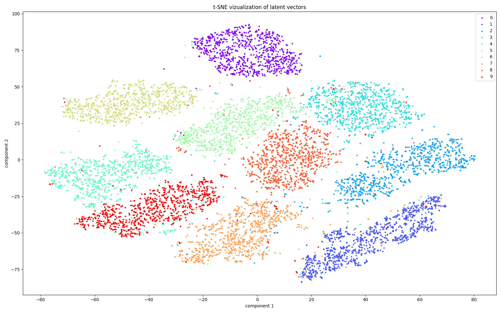

# AAE
Tensorflow2 implementatio of an unsupervised [Adverserial Autoencoder](https://arxiv.org/abs/1511.05644).  
In this project I moved around the components of my [ClusterGAN](https://github.com/Mirabar/ClusterGAN) implementation to resemble an adverserial autoencoder structure.

## Results

### MNIST test set clustering
Using T-SNE

